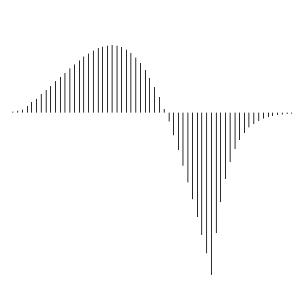
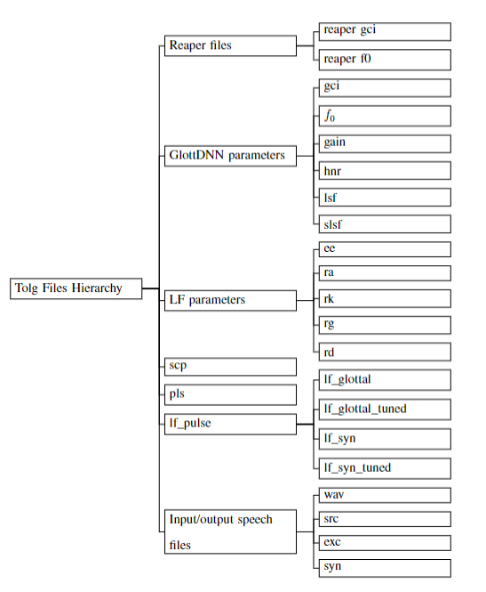
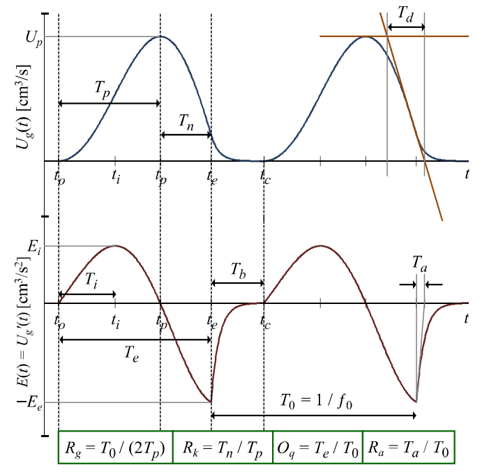
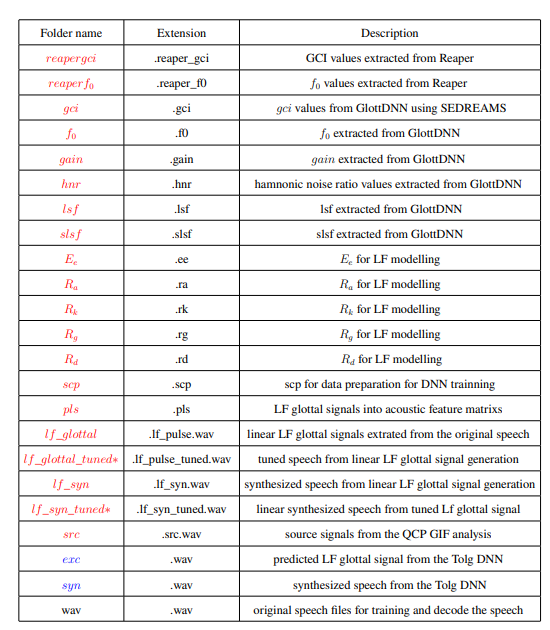
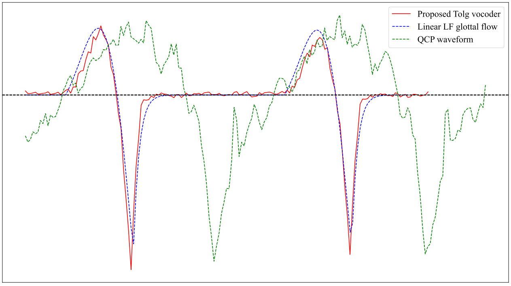
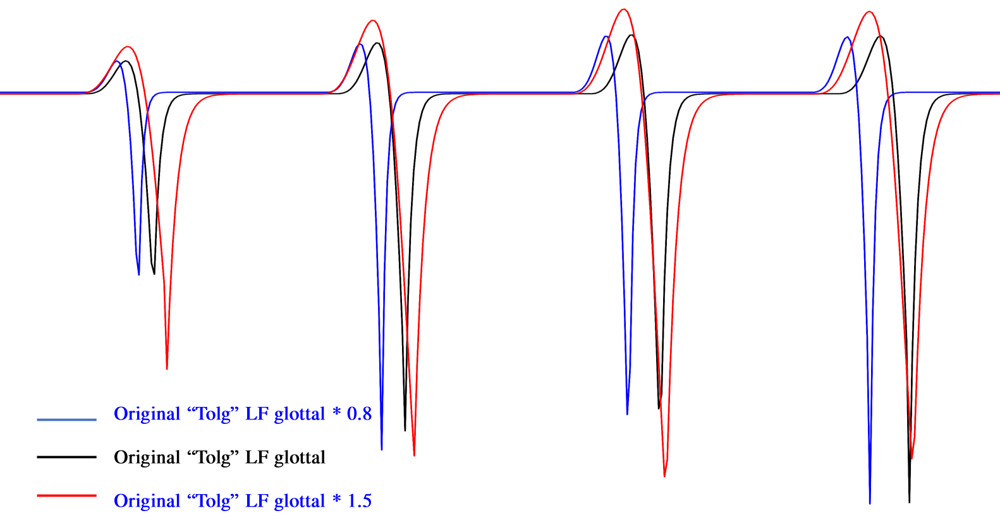

# Tolg

## Acknowledge
The vocoder employed here is derived from GlottDNN vocoder, now featuring the integration of the LF glottal modelling.
https://github.com/ljuvela/GlottDNN


<div align="center">
  
</div>

This classic LF program referred some Matlab code from the original @ Voice_Analysis_Toolkit https://github.com/jckane/Voice_Analysis_Toolkit
written by John Kane (Phonetics and Speech Laboratory, Trinity College Dublin) in Matlab, 
now re-factored and re-written in C++ for better integration for copy-syn and DNN training in GlottDNN: Author: Xiao Zhang (Phonetics and Speech Laboratory, Trinity College Dublin)  zhangx16@tcd.ie

<div align="center">
  
</div>

LF Glottal model pulses (top), flow derivative (bottom).Figure from (Dr. Christer Gobl https://www.tcd.ie/research/profiles/?profile=cegobl)


<div align="center">
  
</div>

Configuration folder reference list. The files obtained from the analysis stage of Tolg are colored red, whereas those from the synthesize stage are colored blue. The conditional
feature, which depends on the value of in the configuration file, is denoted by *.


<div align="center">
  
</div>


Generating the LF glottal excitation signal from the proposed neural Tolg together with the classical Tolg vocoder and LF glottal flow output from GIF.

<div align="center">
  
</div>


The Tolg package contains two main parts:
1) The LF glottal vocoder written in C++
   - Dependencies: `libsndfile`, `libgsl`, `libconfig`

2) Python scripts for LF vocoder analysis, synthesis and training a DNN excitation model:
   - Dependencies: `python3`, `numpy`, `pytorch>=1.1.0`

## Features
1) Instantly tunable LF Vocoder for Voice Quality:
   Easily enhance your voice quality with just a single command-line command.
eg:
Change the parameter under the file, the default value is ```1.0```: 
```
tolg/dnn_demo/config_dnn_demo.cfg
```

```
RD_RATIO =                   1.0;
```

<div align="center">
  
</div>


Here is the tuning cmd line:
```
./src/Analysis <./demo.wav> ../dnn_demo/config_dnn_demo.cfg
```
here is an example:

```
./src/Analysis ../dnn_demo/data/wav/slt_arctic_a0001.wav ../dnn_demo/config_dnn_demo.cfg
```
Here is the modified Rd value:

```
RD_RATIO =                   1.5;
```
It can globally tune your Rd values by multiplying them by 1.5.

(Notice: the Rd_ratio value is a double number, so the decibel is compulsory)
The tuned audio file will be generated under the same path of <./demo.wav>. 


2) Synthesize LF excitation signals using a DNN-based approach

## Installation

The vocoder C++ code has the following library dependencies:
- `libgsl` (GNU scientific library), for basic linear algebra and FFT etc.
- `libsndfile` for reading and writing audio files
- `libconfig++` for reading structured configuration files

Usually the best way to install the dependencies is with the system package manager. For example, in Ubuntu use `apt-get` install the packages `libgsl0-dev`, `libsndfile1-dev`, `libconfig++-dev`

The C++ part uses a standard GNU autotools build system. To compile the vocoder, run the following commands in the project root directory
``` bash
   ./configure
   make
```

Since the build targets are rather generically named `Analysis` and `Synthesis`, you might not want them in your default system PATH. Use the `--prefix` flag to choose another install path
``` bash
   ./configure --prefix=/your/install/path/bin
   make install
```

Usually `configure` and `make` should be enough, but if the process complains about missing files try running 
``` bash
automake --add-missing
```

### Installation using a conda environment

Conda environments are useful for managing dependencies and keeping a Tolg installation contained from the systemwide environment. For more information about managing conda enviroments, see https://docs.conda.io/projects/conda/en/latest/user-guide/tasks/manage-environments.html


Create and activate a new conda environment. 
```bash
conda create -n Tolg
conda activate Tolg
```

Install dependencies
``` bash
conda install -c conda-forge libsndfile gsl libconfig 
```

Optionally, install pytorch with conda
```bash
conda install pytorch torchaudio -c pytorch
```

Set compiler flags to compiler flags to point to the currently active conda environment. The compiled binaries will be installed in `$CONDA_PREFIX/bin/`  
``` bash
export LDFLAGS=-L$CONDA_PREFIX/lib/ 
export CPPFLAGS=-I$CONDA_PREFIX/include/
./configure --prefix $CONDA_PREFIX
make
make install
```

Library dependencies are linked dynamically, so we need to make sure they are is visible in `LD_LIBRARY_PATH`. Adding an `env_vars.sh` activate script is a convenient way to do this automatically whenever the conda environment is activatied.
```bash
# any shell scripts in these directories are run at activation/deactivation
mkdir -p $CONDA_PREFIX/etc/conda/activate.d
mkdir -p $CONDA_PREFIX/etc/conda/deactivate.d

# modify LD_LIBRARY_PATH at activation
export ACTIVATE_SCRIPT=$CONDA_PREFIX/etc/conda/activate.d/env_vars.sh
echo 'export OLD_LD_LIBRARY_PATH=${LD_LIBRARY_PATH}' > $ACTIVATE_SCRIPT
echo 'export LD_LIBRARY_PATH='${CONDA_PREFIX}'/lib/:${LD_LIBRARY_PATH}' >> $ACTIVATE_SCRIPT

# restore LD_LIBRARY_PATH state at deactivation
export DEACTIVATE_SCRIPT=$CONDA_PREFIX/etc/conda/deactivate.d/env_vars.sh
echo 'export LD_LIBRARY_PATH=${OLD_LD_LIBRARY_PATH}' > $DEACTIVATE_SCRIPT
echo 'unset OLD_LD_LIBRARY_PATH' >> $DEACTIVATE_SCRIPT
```


## Easy to go all-in-one Example:

```
python3 ./python/TolgDnnScript.py ./dnn_demo/config_dnn_demo.py
```
The present version requires `pytorch>=1.1.0` and all `theano` dependencies have been removed.

Note that the following is a toy example, since we now use only 10 audio files. This example is intended as a quick sanity check and can be easily run on a CPU. For more data and more complex models, a GPU is recommended.


Before we run anything, you can modify the configuration files below:
```
./dnn_demo/config_dnn_demo.py
```

Then run the example script by running
``` bash
python3 ./python/TolgScript.py ./dnn_demo/config_dnn_demo.py
```


The demo script runs vocoder analysis, trains a DNN excitation model, and finally applies copy-synthesis to the samples.
After running, the copy-synthesis results are stored in `./dnn_demo/data/syn` and the original wave files are in `./dnn_demo/data/wav`.


Upon executing this example, the analyzed files can be located in the respective directories specified below, accompanied by their corresponding file extensions.

The expected outcome should consist of the following files:

```
ls ./data/dnn_demo/data
    /tolg/dnn_demo/data/ee
    /tolg/dnn_demo/data/exc
    /tolg/dnn_demo/data/f0
    /tolg/dnn_demo/data/gain
    /tolg/dnn_demo/data/gci
    /tolg/dnn_demo/data/hnr
    /tolg/dnn_demo/data/lf_pulse
    /tolg/dnn_demo/data/pls
    /tolg/dnn_demo/data/ra
    /tolg/dnn_demo/data/rd
    /tolg/dnn_demo/data/reaper_f0
    /tolg/dnn_demo/data/reaper_gci
    /tolg/dnn_demo/data/rg
    /tolg/dnn_demo/data/rk
    /tolg/dnn_demo/data/scp
    /tolg/dnn_demo/data/slsf
    /tolg/dnn_demo/data/syn
    /tolg/dnn_demo/data/wav    
```


You can read the ```f0``` file by:


```
x2x +fa slt_arctic_a0001.f0 > output.txt
```
Here is to convert an Asscii file into float number.


### LF Acoustic parameter analysis

Now run Tolg Analysis program with default configuration
``` bash
./src/Analysis "$DATADIR/$BASENAME.wav" ./config/config_default_16k.cfg
or
./src/Analysis "$DATADIR/$BASENAME.wav" ./src/config_default_16k.cfg

```

## Built-in neural net excitation model 


### Python config contents
Prepare a directory structure under and make file lists based on contents of the `wav` sub-directory
``` python
make_dirs = 1
make_scp = 1
```


Use Tolg to extract glottal vocoder features and pulses for  excitation model training.
``` python
do_glott_vocoder_analysis = 1
```

Package data and train an excitation model for Tolg, as supported by the internal implementation. Uses `theano` for training and only supports simple fully connected nets with least squares training.
``` python
make_dnn_train_data = 1
make_dnn_infofile = 1
do_dnn_training = 1
```

Do copy synthesis (using the internal implementation of DNN excitation)
``` python
do_glott_vocoder_synthesis = 1
```
